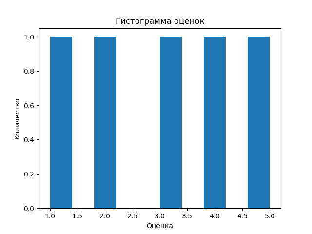
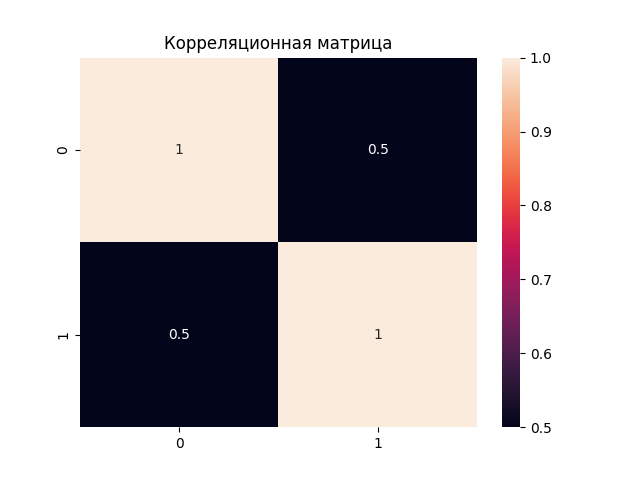
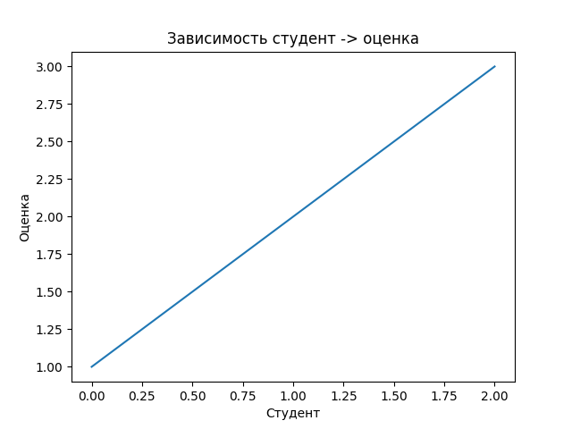

# Отчет по лабораторной работе №2
## Численные вычисления и анализ данных с использованием NumPy

**Выполнил:** Зекин В.К., P3121
**GitHub Pages:** [https://n3sostr3l.github.io/lab2](https://n3sostr3l.github.io/lab2)  

---

## 1. Описание задачи

Цель работы — освоить базовые возможности библиотеки NumPy для численных вычислений и анализа данных, а также научиться визуализировать результаты с помощью Matplotlib и Seaborn.

Необходимо реализовать набор функций, выполняющих:

- создание и преобразование массивов (`create_vector`, `create_matrix`, `reshape_vector`, `transpose_matrix`);
- векторные операции (`vector_add`, `scalar_multiply`, `elementwise_multiply`, `dot_product`);
- матричные операции (`matrix_multiply`, `matrix_determinant`, `matrix_inverse`, `solve_linear_system`);
- статистический анализ (`load_dataset`, `statistical_analysis`, `normalize_data`);
- визуализацию данных (`plot_histogram`, `plot_heatmap`, `plot_line`).

Все функции должны соответствовать стандартам PEP-8, содержать аннотации типов (PEP-484) и докстринги (PEP-257). Корректность работы проверяется с помощью модуля `pytest` (файл `test.py`).

---

## 2. Реализация

### 2.1. Используемые инструменты

- **NumPy** — для операций с многомерными массивами, линейной алгебры и статистики.
- **Pandas** — для загрузки данных из CSV.
- **Matplotlib** — для построения графиков.
- **Seaborn** — для визуализации корреляционных матриц.
- **Pytest** — для автоматического тестирования.

### 2.2. Основные функции и их реализация

**Создание и обработка массивов:**
- `create_vector` — `np.arange(10)`
- `create_matrix` — `np.random.rand(5,5)`
- `reshape_vector` — `vec.reshape(2,5)`
- `transpose_matrix` — `mat.T`

**Векторные операции:**
- `vector_add` — поэлементное сложение (`a + b`)
- `scalar_multiply` — умножение на скаляр (`scalar * vec`)
- `elementwise_multiply` — поэлементное умножение (`a * b`)
- `dot_product` — скалярное произведение (`np.dot(a, b)`)

**Матричные операции:**
- `matrix_multiply` — умножение матриц (`a @ b`)
- `matrix_determinant` — определитель (`np.linalg.det(a)`)
- `matrix_inverse` — обратная матрица (`np.linalg.inv(a)`)
- `solve_linear_system` — решение СЛАУ (`np.linalg.solve(a, b)`)

**Статистический анализ:**
- `load_dataset` — загрузка CSV через `pd.read_csv(path).to_numpy()`
- `statistical_analysis` — вычисление mean, median, std, min, max, процентилей с помощью соответствующих функций NumPy.
- `normalize_data` — Min-Max нормализация: `(data - min) / (max - min)`

**Визуализация:**
- `plot_histogram` — `plt.hist(data)`, подписи осей, заголовок, сохранение.
- `plot_heatmap` — `sns.heatmap(matrix, annot=True, fmt=".2f", cmap="coolwarm")`
- `plot_line` — `plt.plot(x, y, marker='o')`

Пример одной из функций с аннотациями и докстрингом:

```python
def normalize_data(data: np.ndarray) -> np.ndarray:
    """
    Min-Max нормализация массива в диапазон [0, 1].

    Формула: (x - min) / (max - min).

    Args:
        data (numpy.ndarray): Входной массив.

    Returns:
        numpy.ndarray: Нормализованный массив.
    """
    return (data - np.min(data)) / (np.max(data) - np.min(data))
```
## 3. Трудности и их решение
### 3.1. Неправильная передача аргументов в plot_line
При первоначальной реализации в функции plot_line использовалась запись plt.plot(x, data=y), что приводило к некорректному отображению графика, так как параметр data не является координатой Y. После изучения документации Matplotlib вызов был исправлен на стандартный plt.plot(x, y).

### 3.2. Наложение цветовой шкалы от тепловой карты
При последовательном вызове plot_heatmap и plot_line цветовая шкала (colorbar), добавляемая sns.heatmap, оставалась на фигуре и появлялась на следующем графике. Это происходило из-за использования plt.cla() (очистка только осей). Решение — заменить на plt.clf(), которая полностью очищает всю фигуру перед построением нового графика.

### 3.3. Отсутствие папки для сохранения изображений
При первом запуске программы папка plots не существовала, что вызывало ошибку при вызове plt.savefig. Чтобы избежать этого, в начало каждой функции визуализации добавлена проверка и создание папки:

```python
import os
os.makedirs("plots", exist_ok=True)
```
### 3.4. Аннотация типов для скаляра
В функции scalar_multiply второй аргумент может быть как целым, так и вещественным числом. Для корректной аннотации использован Union[float, int] из модуля typing.

## 4. Тестирование
Для проверки корректности всех функций использовался файл test.py, содержащий тесты pytest. Тесты охватывают:

- создание массивов правильной формы;

- математические операции;

- матричные операции;

- статистические показатели;

- нормализацию;

- загрузку данных;

- визуализацию (проверка, что функции выполняются без ошибок).

- Команда для запуска тестов:

```bash
pytest -v test.py
```
Результат:

```bash
=========================================================== test session starts ===========================================================
platform linux -- Python 3.14.2, pytest-9.0.2, pluggy-1.6.0
rootdir: /home/omewa/Projects/python/lab2
collected 17 items                                                                                                                        

test.py .................                                                                                                           [100%]

=========================================================== 17 passed in 2.68s ============================================================

```

## 5. Примеры визуализации
### 5.1. Гистограмма распределения оценок


### 5.2. Корреляционная матрица предметов


### 5.3. Зависимость оценки от номера студента


## 6. Выводы
В ходе выполнения лабораторной работы были освоены:

- основы работы с библиотекой NumPy: создание массивов, индексация, изменение формы, векторизованные вычисления;

- применение линейной алгебры для решения матричных уравнений;

- методы статистического анализа данных;

- визуализация с помощью Matplotlib и Seaborn;

- написание кода в соответствии с PEP-8, аннотирование типов и документирование функций;

- использование модульного тестирования для проверки корректности реализации.

- Все функции реализованы в полном объёме и успешно проходят тесты. Код доступен в репозитории по указанной выше ссылке.

## Код

```py
"""
Лабораторная работа: Численные вычисления и анализ данных с использованием NumPy.
"""

import os
import numpy as np
import pandas as pd
import matplotlib.pyplot as plt
import seaborn as sns
from typing import Union, Dict

# ============================================================
# 1. СОЗДАНИЕ И ОБРАБОТКА МАССИВОВ
# ============================================================

def create_vector() -> np.ndarray:
    """
    Создать массив от 0 до 9.

    Returns:
        numpy.ndarray: Массив чисел от 0 до 9 включительно.
    """
    return np.arange(10)


def create_matrix() -> np.ndarray:
    """
    Создать матрицу 5x5 со случайными числами [0,1].

    Returns:
        numpy.ndarray: Матрица 5x5 со случайными значениями от 0 до 1.
    """
    return np.random.rand(5, 5)


def reshape_vector(vec: np.ndarray) -> np.ndarray:
    """
    Преобразовать вектор формы (10,) в матрицу (2,5).

    Args:
        vec (numpy.ndarray): Входной массив формы (10,).

    Returns:
        numpy.ndarray: Преобразованный массив формы (2, 5).
    """
    return vec.reshape(2, 5)


def transpose_matrix(mat: np.ndarray) -> np.ndarray:
    """
    Транспонирование матрицы.

    Args:
        mat (numpy.ndarray): Входная матрица.

    Returns:
        numpy.ndarray: Транспонированная матрица.
    """
    return mat.T


# ============================================================
# 2. ВЕКТОРНЫЕ ОПЕРАЦИИ
# ============================================================

def vector_add(a: np.ndarray, b: np.ndarray) -> np.ndarray:
    """
    Поэлементное сложение двух векторов одинаковой длины.

    Args:
        a (numpy.ndarray): Первый вектор.
        b (numpy.ndarray): Второй вектор.

    Returns:
        numpy.ndarray: Результат поэлементного сложения.
    """
    return a + b


def scalar_multiply(vec: np.ndarray, scalar: Union[float, int]) -> np.ndarray:
    """
    Умножение вектора на скаляр.

    Args:
        vec (numpy.ndarray): Входной вектор.
        scalar (float|int): Число для умножения.

    Returns:
        numpy.ndarray: Результат умножения вектора на скаляр.
    """
    return scalar * vec


def elementwise_multiply(a: np.ndarray, b: np.ndarray) -> np.ndarray:
    """
    Поэлементное умножение двух массивов одинаковой формы.

    Args:
        a (numpy.ndarray): Первый массив.
        b (numpy.ndarray): Второй массив.

    Returns:
        numpy.ndarray: Результат поэлементного умножения.
    """
    return a * b


def dot_product(a: np.ndarray, b: np.ndarray) -> float:
    """
    Вычисление скалярного произведения двух векторов.

    Args:
        a (numpy.ndarray): Первый вектор.
        b (numpy.ndarray): Второй вектор.

    Returns:
        float: Скалярное произведение.
    """
    return np.dot(a, b)


# ============================================================
# 3. МАТРИЧНЫЕ ОПЕРАЦИИ
# ============================================================

def matrix_multiply(a: np.ndarray, b: np.ndarray) -> np.ndarray:
    """
    Умножение двух матриц.

    Args:
        a (numpy.ndarray): Первая матрица.
        b (numpy.ndarray): Вторая матрица.

    Returns:
        numpy.ndarray: Результат умножения матриц.
    """
    return a @ b


def matrix_determinant(a: np.ndarray) -> float:
    """
    Вычисление определителя квадратной матрицы.

    Args:
        a (numpy.ndarray): Квадратная матрица.

    Returns:
        float: Определитель матрицы.
    """
    return np.linalg.det(a)


def matrix_inverse(a: np.ndarray) -> np.ndarray:
    """
    Вычисление обратной матрицы.

    Args:
        a (numpy.ndarray): Квадратная матрица.

    Returns:
        numpy.ndarray: Обратная матрица.
    """
    return np.linalg.inv(a)


def solve_linear_system(a: np.ndarray, b: np.ndarray) -> np.ndarray:
    """
    Решение системы линейных уравнений Ax = b.

    Args:
        a (numpy.ndarray): Матрица коэффициентов A.
        b (numpy.ndarray): Вектор свободных членов b.

    Returns:
        numpy.ndarray: Решение системы x.
    """
    return np.linalg.solve(a, b)


# ============================================================
# 4. СТАТИСТИЧЕСКИЙ АНАЛИЗ
# ============================================================

def load_dataset(path: str = "data/students_scores.csv") -> np.ndarray:
    """
    Загрузка данных из CSV-файла в массив NumPy.

    Args:
        path (str): Путь к CSV-файлу.

    Returns:
        numpy.ndarray: Загруженные данные.
    """
    return pd.read_csv(path).to_numpy()


def statistical_analysis(data: np.ndarray) -> Dict[str, float]:
    """
    Вычисление основных статистических показателей для одномерного массива.

    Args:
        data (numpy.ndarray): Одномерный массив данных.

    Returns:
        dict: Словарь со статистическими показателями:
            - mean: среднее арифметическое
            - median: медиана
            - std: стандартное отклонение
            - min: минимум
            - max: максимум
            - 25-perc: 25-й перцентиль
            - 75-perc: 75-й перцентиль
    """
    return {
        "mean": np.mean(data),
        "median": np.median(data),
        "std": np.std(data),
        "min": np.min(data),
        "max": np.max(data),
        "25-perc": np.percentile(data, 25),
        "75-perc": np.percentile(data, 75)
    }


def normalize_data(data: np.ndarray) -> np.ndarray:
    """
    Min-Max нормализация массива в диапазон [0, 1].

    Формула: (x - min) / (max - min).

    Args:
        data (numpy.ndarray): Входной массив.

    Returns:
        numpy.ndarray: Нормализованный массив.
    """
    return (data - np.min(data)) / (np.max(data) - np.min(data))


# ============================================================
# 5. ВИЗУАЛИЗАЦИЯ
# ============================================================

def plot_histogram(data: np.ndarray) -> None:
    """
    Построение гистограммы распределения оценок.

    Args:
        data (numpy.ndarray): Одномерный массив оценок.
    """
    plt.clf()
    plt.hist(data, bins='auto', edgecolor='black')
    plt.xlabel("Оценка")
    plt.ylabel("Количество")
    plt.title("Гистограмма оценок")
    plt.savefig("plots/hist.png")
    plt.clf()


def plot_heatmap(matrix: np.ndarray) -> None:
    """
    Построение тепловой карты корреляционной матрицы.

    Args:
        matrix (numpy.ndarray): Квадратная матрица корреляций.
    """
    plt.clf()
    sns.heatmap(matrix, annot=True, fmt=".2f", cmap="coolwarm")
    plt.title("Корреляционная матрица")
    plt.savefig("plots/hmap.png")
    plt.clf()


def plot_line(x: np.ndarray, y: np.ndarray) -> None:
    """
    Построение линейного графика зависимости оценок от номеров студентов.

    Args:
        x (numpy.ndarray): Номера студентов.
        y (numpy.ndarray): Оценки студентов.
    """
    plt.clf()
    plt.plot(x, y, marker='o', linestyle='-')
    plt.title("Зависимость студент -> оценка")
    plt.xlabel("Студент")
    plt.ylabel("Оценка")
    plt.savefig("plots/line.png")
    plt.clf()


if __name__ == "__main__":
    print("Запустите python -m pytest test.py -v для проверки лабораторной работы.")

```