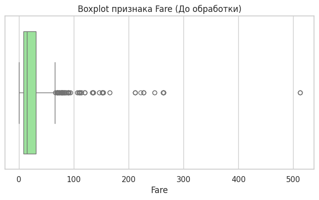
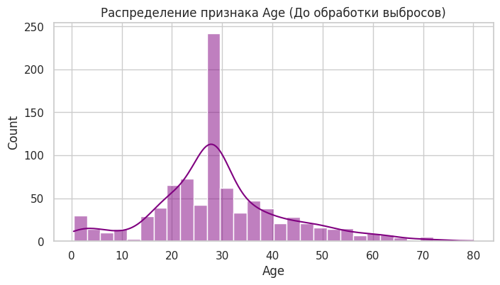
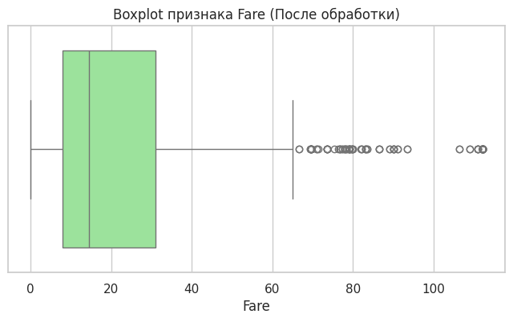
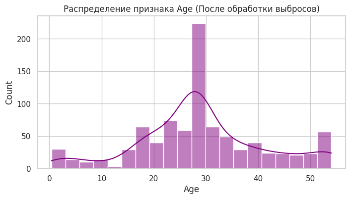

# Отчет по лабораторной работе: Очистка и трансформация данных (Pandas)

**Группа:** P3121

**[Ссылка на Google Colab](https://colab.research.google.com/drive/1_IHPFzJXx8i9BThdq5VLJXpOVmdFaWRF?usp=sharing)**

---

## Введение
### Цель работы
Освоение методов очистки и трансформации данных с использованием библиотеки `pandas` на примере реальных данных пассажиров Титаника из соревнования платформы Kaggle.

### Описание набора данных
Использовался датасет обучающей выборки `train.csv`. Набор содержит 891 запись о пассажирах. Признаки описывают демографические показатели (возраст, пол), социальный статус (класс билета), семейное положение (количество родственников на борту), а также целевую переменную — `Survived` (выжил пассажир или нет, 0/1).

---

## Первичный анализ
### Статистика датафрейма
* **Размерность данных:** 891 строка, 12 столбцов.
* **Типы данных:** включают числа с плавающей точкой (`float64`), целые числа (`int64`) и строки (`object`).
* **Целевая переменная:** `Survived` имеет среднее значение 0.383, что означает, что выжило около 38.3% пассажиров из обучающей выборки.
* **Базовые метрики:** Средний возраст пассажиров составил ~29.7 лет (среди заполненных), средняя стоимость билета (`Fare`) — 32.20.

### Визуализация пропусков
При проверке на пустые значения (`isnull().sum()`) было выявлено 3 проблемных столбца:
1. `Age`: 177 пропусков (~19.8% от всех данных).
2. `Cabin`: 687 пропусков (~77.1% от всех данных).
3. `Embarked`: 2 пропуска (~0.2%).

---

## Обработка пропусков
### Методы заполнения
* **Age (Возраст):** После сравнения среднего значения (29.69) и медианы (28.00), было принято решение использовать медиану (28.0). Это позволило избежать искажений из-за выбросов (возрастных пассажиров).

* **Embarked (Порт посадки):** Два пропущенных значения заполнены наиболее часто встречающимся значением (модой) — портом `S` (Саутгемптон).
* **Cabin (Каюта):** Так как столбец содержал более 77% пропусков, он был удален. Однако предварительно на его основе был создан новый признак, а пропущенные значения заменены на категорию `U` (Unknown).

### Результаты обработки
Все пропуски были устранены. Процент обработанных пропущенных значений составил **100%**. Датасет больше не содержит значений `NaN`.

---

## Трансформация данных
### Созданные признаки
Был проведен Feature Engineering, в результате которого создано 5 новых признаков:
1. `Age_group`: Возраст разбит на 5 категориальных корзин: *Child* (0-12), *Teenager* (12-18), *Young Adult* (18-35), *Adult* (35-60), *Senior* (60+).
2. `Title`: Из столбца `Name` с помощью регулярных выражений выделены обращения. Редкие титулы (Dr, Rev, Col и др.) объединены в группу `Rare`, синонимы приведены к стандарту (Mlle -> Miss).
3. `FamilySize`: Вычислен как сумма братьев/сестер (`SibSp`) и родителей/детей (`Parch`) + 1 (сам пассажир).
4. `IsAlone`: Бинарный признак. Равен 1, если `FamilySize == 1` (пассажир путешествовал один), иначе 0.
5. `Cabin_Letter`: Палуба размещения (первая буква из номера каюты: A, B, C... или U).

### Преобразования типов
* Столбец `Pclass` из числового формата преобразован в категориальный строковый: 1 → `F` (First), 2 → `S` (Second), 3 → `T` (Third).
* Признак `Sex` переведен в бинарный числовой формат: `male` → 0, `female` → 1, что необходимо для будущих моделей машинного обучения.

---

## Обработка выбросов
### Выявленные выбросы
Построенный Boxplot для признака `Fare` (стоимость билета) выявил сильную асимметрию распределения (скошенность вправо). Метод межквартильного размаха (IQR) идентифицировал **116 выбросов**, включая сверхдорогие билеты стоимостью >500. В признаке `Age` гистограмма показала наличие пассажиров старше 65–70 лет, что также является отклонением от основной массы.

### Методы обработки
К данным была применена техника **винзоризации** (Winsorization). Экстремальные значения были жестко ограничены 95-м перцентилем (метод `.clip()`):
* Значения возраста старше 54 лет были заменены на 54.0.
* Стоимость билета свыше 112.08 была заменена на 112.08.  
Данный подход сохранил информацию о высоких значениях признаков, но устранил их искажающее влияние на дисперсию модели.

---

## Агрегация и анализ
### Сводные статистики
С помощью группировок (`groupby`) и сводных таблиц (`pivot_table`) были выявлены следующие закономерности:
1. **Выживаемость по классам:** пассажиры 1-го класса (F) выживали в 62.9% случаев, 2-го (S) — в 47.2%, 3-го (T) — лишь в 24.2%.
2. **Выживаемость по полу и классу:** Женщины в 1-м и 2-м классах выживали почти гарантированно (96.8% и 92.1%). Среди мужчин наибольший шанс выжить был в 1-м классе (36.8%), а наименьший — в 3-м классе (~13.5%).
3. **Возраст по портам посадки:** Медианный возраст по всем портам близок к 28 годам (из-за заполнения медианой), однако пассажиры из порта Q (Квинстаун) в среднем путешествовали без семей и чаще покупали билеты 3-го класса.
4. **Сводная таблица (Age_group, IsAlone, Sex):** Одинокие мужчины-взрослые выживали крайне редко. Самый высокий шанс на спасение имели женщины и дети, путешествующие с семьями (`IsAlone=0`).

### Визуализации
В ходе работы были построены гистограммы распределений, Boxplot для анализа аномалий и тепловая карта (Heatmap) корреляции Пирсона. 
* Выявлена высокая положительная корреляция (0.54) между полом (`Sex=1` - женщины) и целевой переменной `Survived`.
* Наблюдается отрицательная корреляция (-0.20) между `IsAlone` и `Survived` (одинокие спасались реже).
* Положительная связь (0.31) между стоимостью билета `Fare` и шансом на спасение.

---

## Заключение
### Результаты работы
1. Данные успешно считаны, исследованы и трансформированы.
2. Пропущенные значения заполнены с использованием статистических метрик (медиана, мода) или вынесены в отдельную категорию.
3. Извлечено 5 новых, семантически значимых признаков, которые лучше описывают данные.
4. Аномальные значения обработаны методом винзоризации, что улучшило нормальность распределений.
5. Финальный очищенный набор данных сохранен в файл `titanic_cleaned.csv`.

### Выводы
Библиотека `pandas` показала высокую эффективность для задач Data Preprocessing. С помощью агрегации данных была математически подтверждена историческая концепция рассадки по шлюпкам: "Женщины и дети в первую очередь", а также классовое неравенство на борту. Полученный датафрейм теперь очищен от шума, снабжен новыми фичами и полностью готов для тренировки моделей машинного обучения.
